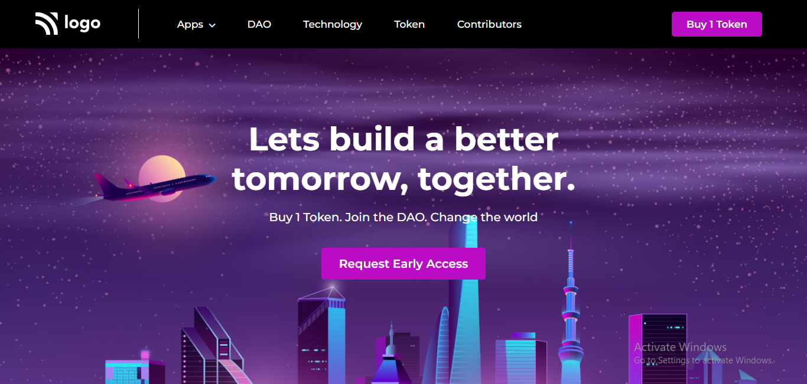

# Portfolio Project 5

## Description

This project is a landing page for a cryptocurrency firm. It is built using `HTML` and `CSS`.

### Learnings from this project -

- How to create a navigation bar
- How to change the color of navigation links upon being hovered
- How to use CSS properties like `background-position` and `background-size`
- How to create buttons and add custom `animations` to them

### Preview of the project

### [Live link](https://portfolio-project-5-inky.vercel.app/) of the project.
